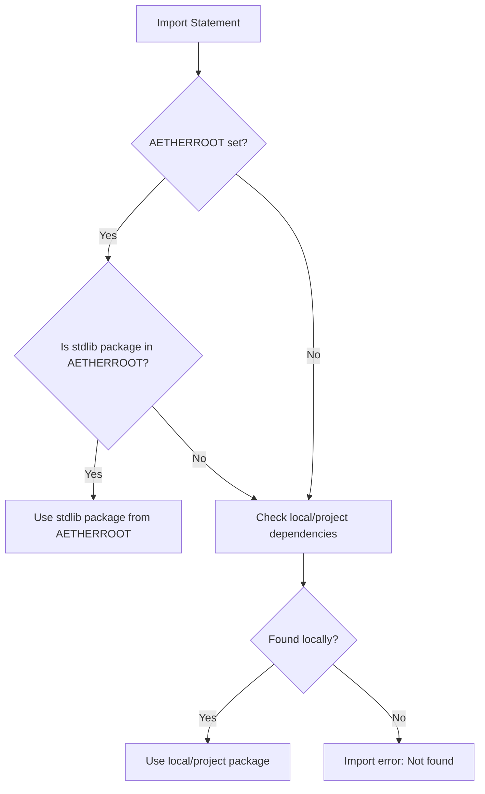

# Aether Standard Library

Welcome to the Aether Standard Library!
This document describes the core packages available in Aether, their purpose, and how to use them.

---

## Import Resolution and AETHERROOT

When you write an import like `import "fmt"`, the Aether compiler resolves it as follows:

1. **Checks AETHERROOT for stdlib packages:**
   - If the `AETHERROOT` environment variable is set, the compiler looks for the package in `$AETHERROOT/packages/`.
   - If found, it uses the stdlib package from there.
2. **Falls back to local/project resolution:**
   - If not found in AETHERROOT, or if `AETHERROOT` is not set, the compiler checks your project’s dependencies and local files as before.

If the package is not found in either location, you’ll get an import error.



---

## Table of Contents

- [fmt](#fmt)
- [math](#math)
- [string](#string)
- [Other Packages](#other-packages)

---

## fmt

The `fmt` package provides formatted I/O functions, similar to Go’s `fmt`.

**Import:**
```aether
import "fmt"
```

**Functions:**
- `fmt.Print(value)` — Print a value to the console.
- `fmt.Println(value)` — Print a value followed by a newline.
- `fmt.Printf(format, ...)` — Print formatted output.

**Example:**
```aether
import "fmt"

fn main() {
    fmt.Println("Hello, World!")
    fmt.Printf("Number: %d\n", 42)
}
```

---

## math

The `math` package provides basic and advanced mathematical functions.

**Import:**
```aether
import "math"
```

**Functions:**
- `math.Add(a, b)`
- `math.Sub(a, b)`
- `math.Mul(a, b)`
- `math.Div(a, b)`
- `math.Sqrt(x)`
- `math.Pow(x, y)`

**Example:**
```aether
import "math"

fn main() {
    result = math.Add(10, 20)
    root = math.Sqrt(16)
}
```

---

## string

The `string` package provides string manipulation utilities.

**Import:**
```aether
import "string"
```

**Functions:**
- `string.Len(s)`
- `string.Concat(a, b)`
- `string.Equal(a, b)`

---

## Other Packages

- Add documentation for additional standard library packages here as they are developed.

---

## Installation Layout and AETHERROOT

When you install Aether (via tarball, .deb, .rpm, .pkg, etc.), the installer will place the Aether binary and the standard library in the following structure:

```
/usr/local/aether/
  bin/
    aether         # The Aether compiler binary
  packages/
    fmt/
    math/
    string/
    ...            # (copied directly from the source /packages)
```

- On Windows, this will be under `C:\Program Files\Aether\`.
- The installer also creates a symlink at `/usr/local/bin/aether` for convenience (on Unix-like systems).

**AETHERROOT** should be set to `/usr/local/aether` (or the equivalent install path on your system).

### How to Set AETHERROOT
- **Unix/Linux/macOS:**
  ```sh
  export AETHERROOT=/usr/local/aether
  ```
- **Windows (cmd):**
  ```cmd
  set AETHERROOT=C:\Program Files\Aether
  ```
- **Windows (PowerShell):**
  ```powershell
  $env:AETHERROOT = "C:\Program Files\Aether"
  ```

### How the CI/Installer Works
- The CI workflow copies the entire `packages/` directory from the source into the install root.
- All packaging formats (.deb, .rpm, .pkg, .dmg, .tar, etc.) include both the binary and the stdlib in this structure.
- When you run the Aether compiler, it will automatically use the stdlib from `$AETHERROOT/packages/`.

---

If you have questions or want to contribute to the installer or packaging scripts, see the repository or open an issue!

## Contributing

If you want to propose changes or additions to the standard library, please open an issue or pull request! 